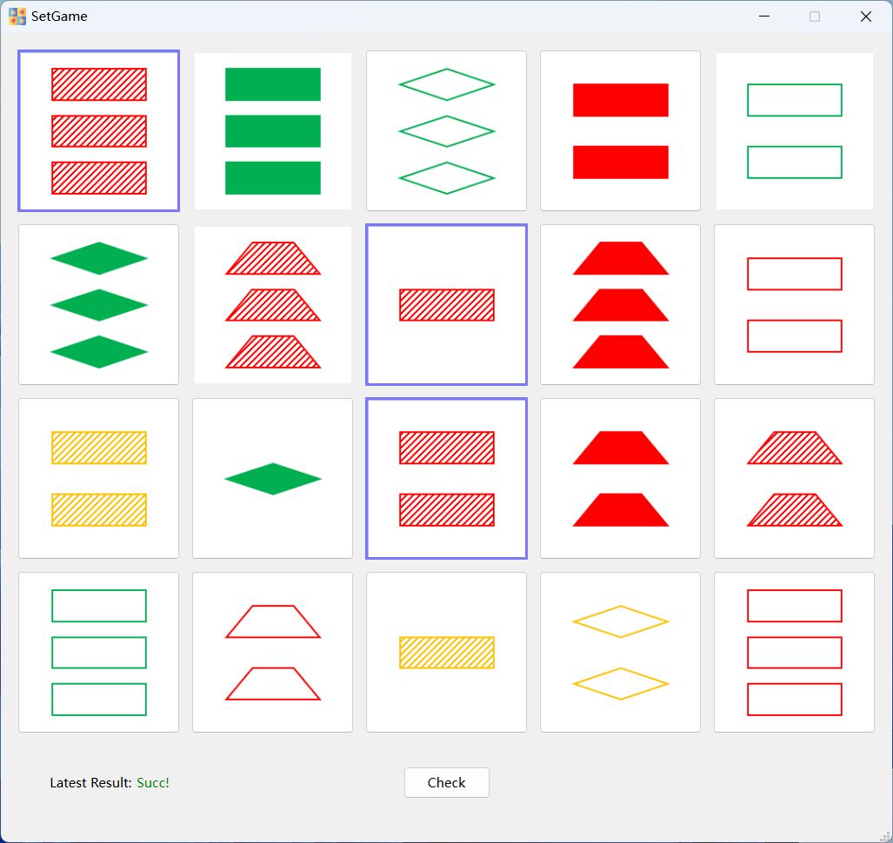

# What is it
This is a very basic offline toy, designed solely for entertainment purposes.
# How to play
## Rules
Each card features four attributes: shape, color, fill, and number, with each attribute having three possible values. This combination results in a total of 81 unique cards. In the game, 20 distinct cards are randomly displayed. Your task is to choose three cards that meet the following criteria: for each attribute, the values must either be identical across all three cards or entirely different.  
Consider the example illustrated below, where the selected combinations satisfy:
1. Shape: all are rectangles.
2. Color: All are red.
3. Fill: all are texture fills.
4. number: completely different, 1, 2, 3.

<left>
    
</left>

Click the 'Check' button to verify your answer. If correct, three new cards will be generated.
## How to get started
A ready-to-use version is available in the release list. You can also compile it yourself, the dependencies are Qt and CMake.
## Bad case
Is it possible to have no solution? If 21 different cards are randomly displayed, a valid combination is guaranteed to exist. For 20 cards, there might not be a valid combination, but the probability of this occurring is very low. For more information, refer to the references at the end of the document.
# TODO
1. Shuffle function: Restart with a new set of cards when you can't find the answer.
2. Timing function: Track how quickly you can find out the answer.
3. Historical statistics.
# References
1. [Wiki-Set(Card game)](https://en.wikipedia.org/wiki/Set_(card_game))
2. [In the card game Set, what's the probability of a Set existing in n cards?](https://math.stackexchange.com/questions/202862/in-the-card-game-set-whats-the-probability-of-a-set-existing-in-n-cards)
3. [A question related to the card game "Set"](https://math.stackexchange.com/questions/6190/a-question-related-to-the-card-game-set)